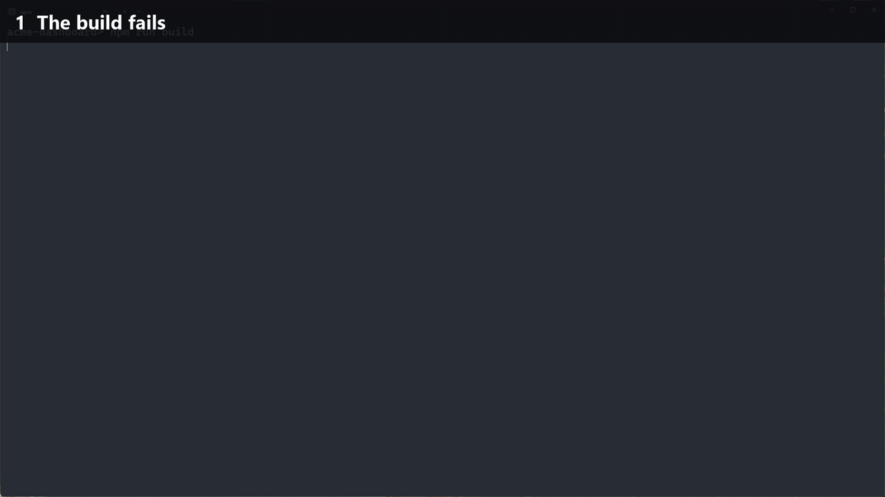

# desktop-sense

**Your AI coding assistant can finally see what you're doing.**

desktop-sense is a small local daemon for Windows (macOS in beta) that tells Claude Code (and Codex CLI / Gemini CLI) what's on your screen — automatically, on every message. No more pasting screenshots, copying error text, or explaining "I'm in the browser looking at the deploy log".



*Real recording, waits sped up: the build fails → desktop-sense notices the error and pops a tip → you just ask Claude Code "why is this failing?".*

[English](README.md) · [繁體中文](README.zh-TW.md) · MIT · Windows 10/11 · macOS 12+ (beta)

---

## What it does

- **Live context on every prompt.** A hook adds a short, fenced block to each message: the window you're in, a timeline of the last 20 minutes, errors visible on screen and the latest screenshot path. Your assistant just *knows*.
- **Token-thrifty.** Within one conversation it only sends what changed since your previous message. The first block is a few hundred to ~1,500 tokens depending on how busy your last 20 minutes were; follow-ups are usually under 200.
- **Error radar.** Spots `Traceback`, `npm ERR!`, `error TS…`, failed builds and repeated commands on screen, and runs a quick background analysis (Haiku) with a fix suggestion and a Windows notification.
- **Auto-research.** Hit the same error twice in your terminal or editor? desktop-sense searches **GitHub issues, Reddit and Stack Overflow** for it and hands you the most likely fix with links — usually before you've finished typing your question. Starting something new? It looks for **existing open-source projects** first, so you don't rebuild what's already out there.
- **"Watch me" mode.** `ds stream` + Claude Code's Monitor tool = your assistant reacts to events as they happen.
- **`/desk` skill + `ds` CLI** for timelines, screenshots, OCR text and analyses on demand.

## Privacy: local-first

- **No server, no account, no telemetry.** desktop-sense itself never talks to the internet — the only connection it can open on its own is to a local model server on your own PC, if you turn on [fully local mode](#fully-local-mode-ollama--lm-studio) (localhost only unless you explicitly allow another host). Screenshots, OCR text, the timeline and analyses live in `data/` on your PC.
- **The only thing that leaves your machine** is what *your own* AI assistant sees, sent with *your own* account — exactly as if you had pasted it yourself:
  - the hook block goes into your own conversations;
  - the background analyzer sends the latest screenshot and de-identified OCR text of an allowed window through your `claude` CLI;
  - auto-research sends only the error line or topic text (never screenshots) and may only use web search.
  Set `analyzer.enabled` and `research.enabled` to `false` and only the hook block is left.
- **Sensitive windows are never captured.** Password managers, incognito / private browsing windows (Chrome, Brave, Opera and Vivaldi give incognito windows the same title as normal ones, so desktop-sense checks the browser's accessibility tree instead), online-banking pages, medical records, adult sites and secret files (`.env`, private keys, credentials) are recorded as the app name only — no title, no screenshot, no OCR. The built-in keywords cover English, Traditional & Simplified Chinese, Japanese, Korean, Spanish, French, German and Portuguese; add your own bank or client names in `config.json`. Chat apps, web mail, video calls and games are title-only.
- **Secrets on screen drop the whole screenshot.** API keys and tokens (OpenAI, Anthropic, GitHub, GitLab, AWS, Google, Slack, Supabase, npm, Hugging Face, SendGrid, Stripe webhooks, Discord, Telegram…), JWTs, private keys, URLs with passwords, `PASSWORD=...` style assignments, card numbers and Taiwanese ID numbers → the image is discarded, not just blurred, because the analyzer would otherwise see the original pixels.
- **Rules apply retroactively.** Add a rule later and it also hides matching titles, screenshots, commands, file paths, errors and analyses that were recorded before.
- **Your rules can only add protection.** Lists in `config.json` are merged on top of the defaults; an old or broken config can never switch a built-in protection off.
- `ds pause 30` stops recording for 30 minutes. Screenshots are deleted after 48 h, the timeline after 30 days, analyses and search results after 90 days.

Screen and web text is treated as **untrusted data**: invisible characters are stripped, everything is sanitized and wrapped in a random fence, live-stream lines are tagged `[screen data]`, auto-search links are only clickable for well-known developer sites (GitHub, Stack Overflow, Reddit, …), and your assistant is told never to act on instructions found inside (prompt-injection defense). The analyzer and auto-search run `claude` in a sandbox: an empty working folder, no CLAUDE.md / plugins / hooks (`--safe-mode`), no code-running tools (`--restricted`), and only errors seen in your terminal or editor — never a web page — can trigger a search.

## Security model and limits

desktop-sense reads your screen, so here is plainly what it does and doesn't protect against:

- **Prompt injection can be reduced, not eliminated.** A web page, email or chat message on your screen can contain text written to steer an AI. desktop-sense fences and sanitizes screen text and tells your assistant it's untrusted, but a model can still be fooled. If you let your assistant run commands without asking (auto-approve or bypass-permissions modes), you carry more of that risk.
- **What's on disk isn't encrypted.** `data/` is readable only by your user account (the installers lock it down), but anything running as you, malware included, can read it. Your assistant's own transcripts (e.g. `~/.claude/projects`) also keep the context blocks it received, under that tool's retention.
- **Detection is best-effort.** Sensitive-window rules match app names and title keywords, and secret detection depends on OCR reading the text correctly. Add rules for whatever matters to you, and use `ds pause` when you need to.
- **macOS permission scope.** Screen Recording is granted to `~/Applications/desktop-sense.app`. Its launcher only ever starts this installation's daemon (the path is compiled in, its arguments are ignored) and drops `DYLD_*` and `PYTHON*` environment variables, so other programs can't borrow the permission through it. Malware already running as you could still modify desktop-sense's own files, as with any tool you grant Screen Recording to, including your terminal.
- **No network surface.** desktop-sense opens no listening ports and sends no telemetry.

Found a security problem? Please [report it privately](https://github.com/angletech2026-arch/desktop-sense/security/advisories/new) instead of opening a public issue.

## Supported tools

| Tool | How | Status |
|---|---|---|
| **Claude Code** | `UserPromptSubmit` hook + `/desk` skill | ✅ daily-driven |
| **Codex CLI** | `UserPromptSubmit` hook (`~/.codex/hooks.json`) | ✅ tested with Codex CLI 0.161 on Windows — run `/hooks` once in Codex to trust it |
| **Gemini CLI** | `BeforeAgent` hook (`~/.gemini/settings.json`) | 🧪 experimental |

The background analyzer and auto-research run through the `claude` CLI (`claude -p`), so they need Claude Code installed. The hook itself works with all three.

## Install

### Windows

Requirements: Windows 10/11, Python 3.10+ (`winget install Python.Python.3.12`), and Claude Code / Codex CLI / Gemini CLI.

```powershell
git clone https://github.com/angletech2026-arch/desktop-sense
cd desktop-sense
powershell -ExecutionPolicy Bypass -File install.ps1
```

The installer creates a virtual environment, puts `ds` on your PATH, connects every AI tool it finds (backing up their settings first and touching only its own hook entry), enables start-at-login and starts the daemon. If you cloned outside your user folder (e.g. `D:\dev`), it also restricts the folder to your account, since drive-root folders are writable by every local user. Open a new terminal afterwards.

### macOS (beta)

Requirements: macOS 12+, Apple's command line tools (`xcode-select --install`; you already have them if you use git or Homebrew), Python 3.10+ (`brew install python` — or, if you have no admin password, install [uv](https://docs.astral.sh/uv/) and the installer downloads Python for you), and Claude Code / Codex CLI / Gemini CLI. Clone it somewhere like `~/desktop-sense` — **not** inside Documents, Desktop, Downloads or iCloud Drive (macOS blocks background apps there, and iCloud would upload your screenshots; the installer refuses those locations).

```bash
git clone https://github.com/angletech2026-arch/desktop-sense ~/desktop-sense
cd ~/desktop-sense
./install.sh
```

Then allow **Screen Recording** for **desktop-sense** (System Settings → Privacy & Security → Screen & System Audio Recording; just "Screen Recording" on older macOS) and run `ds restart`. macOS usually asks right away; if desktop-sense isn't in the list, click **+** and choose `~/Applications/desktop-sense.app`. Without the permission, desktop-sense still tracks which app you're in but can't read window titles or take screenshots — `ds status` tells you when it's missing, and the daemon notifies you if macOS revokes it later.

Why an app: macOS only grants Screen Recording to apps — a plain Python can't even be added to that list — so the installer builds a tiny launcher, `~/Applications/desktop-sense.app` (source: [`macos/launcher.c`](macos/launcher.c), built on your machine), that runs the Python daemon. The app can only start this installation's daemon, so nothing else can borrow the permission (see [Security model and limits](#security-model-and-limits)). It's rebuilt only when its source or the folder's location changes, so updates don't make macOS ask again.

Incognito on macOS: for Chrome, Brave, Edge, Vivaldi and Opera, desktop-sense asks the browser whether the front window is incognito (macOS asks you once whether desktop-sense may control the browser). Until that's allowed — and always for Safari and Arc, which can't be asked — browser windows are **title-only (no screenshots)**. Privacy first: if desktop-sense can't tell, it doesn't capture.

Under the hood: windows are read with Quartz, text with Apple's on-device Vision OCR, and apps are identified by bundle id (e.g. `com.google.Chrome`), so rules don't break when your system language changes. The macOS version is covered by automated tests on macOS but hasn't been used by many people yet — please [open an issue](https://github.com/angletech2026-arch/desktop-sense/issues) if something's off.

Then just talk to your assistant:

- "look at this error" / "what's wrong on my screen?"
- "what was I doing for the last hour?"
- "watch me while I debug this and tell me if you spot something"

## Commands

| Command | What it does |
|---|---|
| `ds status` | daemon status, analyses this hour |
| `ds now` | the full context block your assistant sees |
| `ds recent 60` | timeline of the last 60 minutes, commands and errors |
| `ds shot 3` | the 3 latest screenshots (paths) |
| `ds analyze [--deep]` | run an analysis right now |
| `ds research` | search GitHub / Reddit / Stack Overflow for the latest error |
| `ds research "topic"` | look for existing projects similar to what you're building |
| `ds research --list` | past results with links |
| `ds stream` | one line per notable event (for Claude Code's Monitor) |
| `ds pause 30` / `ds resume` | pause / resume recording |
| `ds setup [claude\|codex\|gemini] [--remove]` | connect / disconnect AI tools |
| `ds config` | where the config and data live |

## Configuration

Put only what you want to change in `config.json` (created on first run, never committed). Privacy lists are **added** to the defaults:

```json
{
  "language": "auto",
  "privacy": {
    "blocked_title_regex": ["my-client-project", "Payroll"],
    "no_capture_apps": ["MyGame.exe"]
  },
  "file_watch": { "roots": ["C:\\Users\\you\\projects"] },
  "analyzer": {
    "user_profile": "Full-stack dev, Next.js + Supabase; wants short, concrete fixes",
    "periodic_minutes": 20
  },
  "research": { "enabled": true, "max_per_day": 8 }
}
```

Run `ds config` to see the effective settings. All defaults are in [`dsense/config.py`](dsense/config.py).

## Fully local mode (Ollama / LM Studio)

> Tested with Ollama 0.40 + `gemma3:4b` on an RTX 3060 Ti, through both Ollama's native API and its OpenAI-compatible API (~10 s per analysis once the model is loaded; the first call takes about a minute). LM Studio / llama.cpp / vLLM use the same OpenAI-compatible format but haven't been tested directly yet — reports welcome. Small models give rougher summaries; `qwen2.5vl:7b` or larger reads screens noticeably better.

Don't want desktop-sense to send screenshots anywhere? Point the analyzer at a local vision model:

1. Install [Ollama](https://ollama.com) and pull a vision model: `ollama pull gemma3:4b` (about 3 GB; `qwen2.5vl:7b` reads screens better if you have 8 GB+ of VRAM).
2. In `config.json`:
   ```json
   { "analyzer": { "backend": "ollama", "local": { "model": "gemma3:4b" } } }
   ```
3. `ds restart`, then check `ds status`.

LM Studio, llama.cpp and vLLM work too with `"backend": "openai"` (any OpenAI-compatible server; default `http://127.0.0.1:1234/v1`). In local mode desktop-sense's own analysis is free and never leaves your machine, and auto-research (which needs the web) switches itself off. Your coding assistant still receives the short context block as usual — and if you ask it to open a screenshot, that image goes to its provider like any file you share. Error detection and OCR are local in every mode.

## Cost

- **Background analysis:** Haiku, about $0.002 per run; every 20 min while you're active plus on errors, capped at 12/hour — typically a few cents a day.
- **Auto-research:** Sonnet + web search, only when an error repeats, when the analyzer thinks you are stuck, or when you start something new — capped at 8/day and $0.50 per search.
- With a Claude subscription these count against your plan's usage instead of being billed.
- In fully local mode: $0.
- A full day of normal use on our machine: 15 analyses + 2 searches ≈ US$0.19.

## How is this different from…

- **Screenpipe** records everything 24/7 and lets your assistant *search* that history over MCP. desktop-sense is the opposite trade-off: it *pushes* only the current context into each message, keeps very little (screenshots expire after 48 h), drops sensitive screens instead of recording them, and adds error detection and auto-research.
- **Screenshot MCP servers** take a picture when the model decides to call them. desktop-sense is already there before you ask, with a timeline, not just one frame.
- **OpenAI's [Computer History](https://learn.chatgpt.com/docs/customization/computer-history)** (formerly Chronicle) builds memories for ChatGPT and Codex from what you do on your Mac. Interaction events are summarized on OpenAI's servers, and it needs a Pro, Business or Enterprise plan. desktop-sense works with Claude Code, Codex CLI and Gemini CLI on Windows and macOS, is free and open source, keeps its records on your machine, and gives your assistant live context with every message rather than memories.

## Uninstall

```powershell
powershell -ExecutionPolicy Bypass -File uninstall.ps1          # Windows, keeps your data
powershell -ExecutionPolicy Bypass -File uninstall.ps1 -Purge   # also deletes data, config and .venv
```

```bash
./uninstall.sh            # macOS, keeps your data
./uninstall.sh --purge    # also deletes data, config and .venv
```

## FAQ

**Linux?** Not yet. Windows is stable, macOS is in beta.

**Does it slow my PC down?** It polls the foreground window once a second, only captures when the window content actually changes, and runs OCR locally. On our machine it averages about 3% of a single CPU core and ~80 MB of RAM.

**Which languages does it support?** It runs on Windows and macOS in any system language, and your assistant understands window titles and screen text in any language.
- **Interface** (CLI, notifications, analyses): English and Traditional Chinese, picked from your Windows language (override with `"language": "en"` / `"zh"`).
- **OCR:** on Windows, any language you have a Windows OCR pack for (Settings → Time & language → Language — about 25 languages including English, Chinese, Japanese, Korean and most European languages); on macOS, Apple Vision (English, Chinese, Japanese, Korean and the major European languages). Set `capture.ocr_language` (e.g. `en-US`, `ja`, `de-DE`) to pick one.
- **Built-in privacy keywords:** English, Traditional & Simplified Chinese, Japanese, Korean, Spanish, French, German and Portuguese. For other languages, add your own terms in `config.json`.

## License

[MIT](LICENSE) © 2026 [AngleTech](https://angletech.io)
